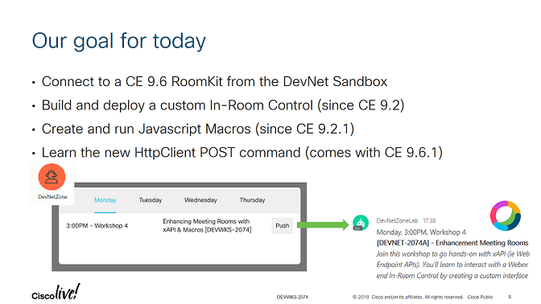

# DEVWKS-2074 - Enhancement Meeting Rooms User Experience with xAPI and Macros

This workshop is scheduled at Cisco Live Barcelona 2019 (check the deck for details)
TODO: Add deck post CL19B

> Join this workshop to go hands-on with xAPI (ie Webex Devices APIs and Cisco Collaboration Endpoint APIs). You'll learn to interact with a Webex Device from code, and implement an end-to-end In-Room Control by creating a custom interface and deploying Macros onto your device
> [check the sessions details](https://ciscolive.cisco.com/emea/learn/sessions/content-catalog/?search=2074#/)

In 45 min, you will learn to
- use a Sandbox’ed RoomKit
- build a custom In-Room Control
- listen to events via ssh
- create your first Macro
- post to a Webex Teams space with the HttpClient command

 


## Walkthrough

If you're new to Cisco Collaboration Devices, take this [DevNet learning module](https://learninglabs.cisco.com/modules/xapi-intro).

Then:
- reserve a [Sandbox'ed CE9.6 Roomkit](https://github.com/CiscoDevNet/awesome-xapi#developer-tools)
  or use the training pod provided at your event (VPN to devnetsandbox-emea-gwy.cisco.com:20339)
- load and deploy the [provided In-Room control](./agenda.xml)
- connect via ssh and type
   ```shell
   xstatus UserInterface Extensions
   xfeedback register /Event/UserInterface/Extensions/Event/Clicked
   xfeedback deregisterall
   ```
- create and enable the [provided JS macro](./step3-complete.js)


## Step by step instructions

<!-- toc -->

_Tip: check the raw contents, these are ready to paste into a Webex Teams space_

### Step 0.1

Let's connect to our RoomKit
```
Sandbox VPN           : devnetsandbox-emea-gwy.cisco.com:20339
Sandbox user          : user01 user02 user03 user04
Sandbox password      : cisco1234
RoomKit IP            : https://10.10.1.171 172 173 174 …
RoomKit user          : admin
RoomKit passwd        : ciscopsdt
```

### Step 0.2

From the terminal, open a ssh session to your device (use PUTTY if on windows):
- ssh 10.10.20.17X
- user: admin
- password: ciscopsdt

Then type commands one at a time:
```xstatus UserInterface Extensions
xfeedback register /Event/UserInterface/Extensions/Event/Clicked
```

When done, unregister with command:
```
xfeedback deregisterall
```

### Step 1

Once the agenda In-Room control has been created, 
open the Macro Editor and create a new `listen` macro with the following script:

```javascript
const xapi = require('xapi')

xapi.event.on('UserInterface Extensions Event Clicked Signal', (widgetId) => {
    console.log(`new event from widget: ${widgetId}`)
    
    // Add your custom logic
})

console.log('listening...')
```


### Step 2.1

We'll now configure your device to allow Http POST/PUT requests

Go back to your ssh session and type the commands below, one at a time:

```sh
xConfiguration HttpClient Mode: On
xConfiguration HttpClient AllowInsecureHTTPS: True
```


### Step 2.2

Create another macro named `push` with the following script,
and place your first name on the last line:

```javascript
const xapi = require('xapi');

function push(msg, cb) {

  // Replace with your bot token
  const token = "YTJkZDlmZjAtMGM3NS00MDUxLWIzNzItNmU0M2I2MDE0ZGRmODcwMTExZGUtNzU0_PF84_adfd15eb-84e9-4906-b553-94182dee9ade"
  // replace with a space your bot is part of
  const roomId = "Y2lzY29zcGFyazovL3VzL1JPT00vYmEzMmZiMjAtMjE1OS0xMWU5LTlkNDktZmI5NTAxNDlhODVl"

  // Post message
  let payload = {
    "markdown": msg,
    "roomId": roomId
  }
  xapi.command(
    'HttpClient Post',
    {
      Header: ["Content-Type: application/json", "Authorization: Bearer " + token],
      Url: "https://api.ciscospark.com/v1/messages",
      AllowInsecureHTTPS: "True"
    },
    JSON.stringify(payload))
    .then((response) => {
      if (response.StatusCode == 200) {
        console.log("message pushed to Webex Teams")
        if (cb) cb(null, response.StatusCode)
        return
      }
            
      console.log("failed with status code: " + response.StatusCode)
      if (cb) cb("failed with status code: " + response.StatusCode, response.StatusCode)
    })
    .catch((err) => {
      console.log("failed with err: " + err.message)
      if (cb) cb("Could not post message to Webex Teams")
    })
}

push('Hi, this is Steve! I am performing well so far...', console.log)
``` 


### Step 3

Now **disable** the `listen` and `push` macros, 
and create a new `workshop` macro with the following contents:

```javascript
const xapi = require('xapi')

xapi.event.on('UserInterface Extensions Event Clicked Signal', (widgetId) => {
    console.log(`new event from widget: ${widgetId}`)
    
    let markdown = buildMarkdownForSession(widgetId)
    push(markdown)
})


function buildMarkdownForSession(widgetId) {

    let markdown = `no session found for widget identifier: ${widgetId}`
    let session = sessions[widgetId]
    if (session) {
      console.log(`found session with id: ${widgetId}`)
      markdown = `${session.day}, ${session.time}, ${session.location}`
      markdown += `<br/>**\[${session.id}\] - ${session.title}**`
      markdown += `<br/>_${session.description}_`
    }
    
    return markdown
}

const sessions = {}
sessions['DEVWKS-2074'] = {
    id: 'DEVWKS-2074',
    title: "Enhancement Meeting Rooms User Experience with xAPI and Macros",
    description: "Join this workshop to go hands-on with xAPI (ie Webex Devices APIs and Cisco Collaboration Endpoint APIs). You'll learn to interact with a Webex Device from code, and implement an end-to-end In-Room Control by creating a custom interface and deploying Macros onto your device",
    location: "Workshop 4",
    type: "workshop",
    day: "Monday",
    time: "3:00PM",
    duration: "45",
    speaker: "Stève Sfartz",
    href: "https://ciscolive.cisco.com/emea/learn/sessions/content-catalog/?search=2074#/"
}


function push(msg, cb) {

  // Replace with your bot token
  const token = "MzlkMDU2NzktZWY0OC00MjExLTlhNjItZTFjZDMzMjEzZWU5OTRlODZmZDktZGY2_PF84_adfd15eb-84e9-4906-b553-94182dee9ade"
  // replace with a space your bot is part of
  const roomId = "Y2lzY29zcGFyazovL3VzL1JPT00vYzg0NjlkZDAtMWVmNi0xMWU5LWI1MWYtOTUyNzFiZGM2ZTIz"

  // Post message
  let payload = {
    "markdown": msg,
    "roomId": roomId
  }
  xapi.command(
    'HttpClient Post',
    {
      Header: ["Content-Type: application/json", "Authorization: Bearer " + token],
      Url: "https://api.ciscospark.com/v1/messages",
      AllowInsecureHTTPS: "True"
    },
    JSON.stringify(payload))
    .then((response) => {
      if (response.StatusCode == 200) {
        console.log("message pushed to Webex Teams")
        if (cb) cb(null, response.StatusCode)
        return
      }
            
      console.log("failed with status code: " + response.StatusCode)
      if (cb) cb("failed with status code: " + response.StatusCode, response.StatusCode)
    })
    .catch((err) => {
      console.log("failed with err: " + err.message)
      if (cb) cb("Could not post message to Webex Teams")
    })
}

console.log('listening...')
```